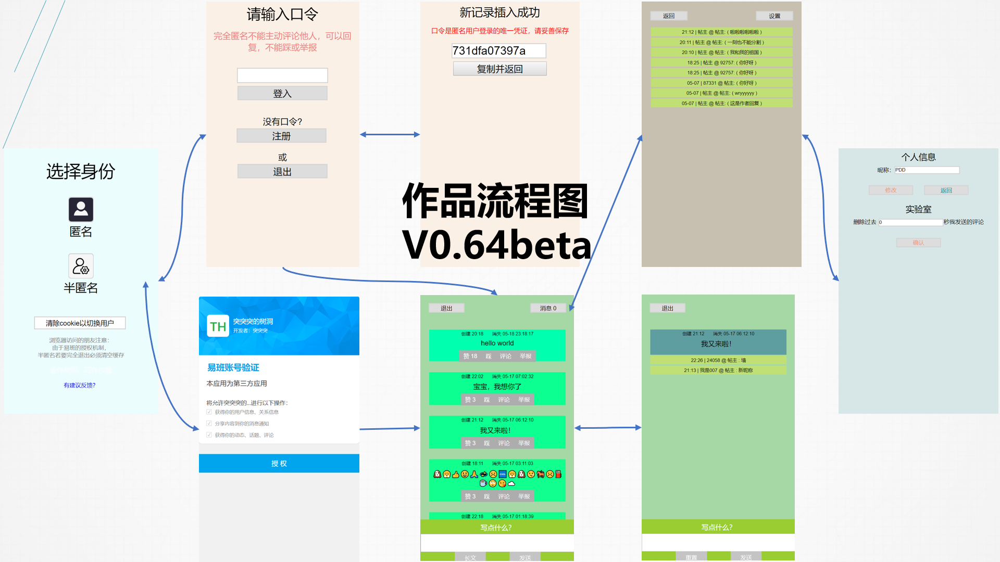
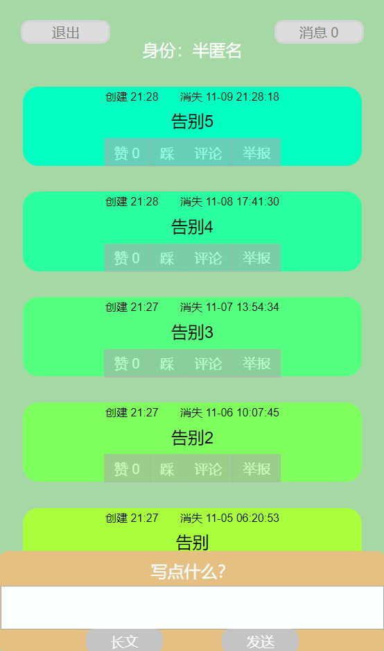

# 2019年5月易班轻应用大赛
## 东华树洞
> 2019.11开源

你看，这么多代码一点点查，一点点打，最后是个参与奖

菜鸡辛辛苦苦做的不及大佬几个小时各种框架界面一搭的app

## 架构 php + mysql + windows server 

## 阿里云服务器关停，保存了mhtml，如下

[欢迎](saved_mhtml/欢迎.mhtml)

[匿名登入](saved_mhtml/匿名登入.mhtml)

[评论](saved_mhtml/评论.mhtml)

[设置](saved_mhtml/设置.mhtml)

[树洞](saved_mhtml/树洞.mhtml)

[易班授权](saved_mhtml/易班授权.mhtml)
